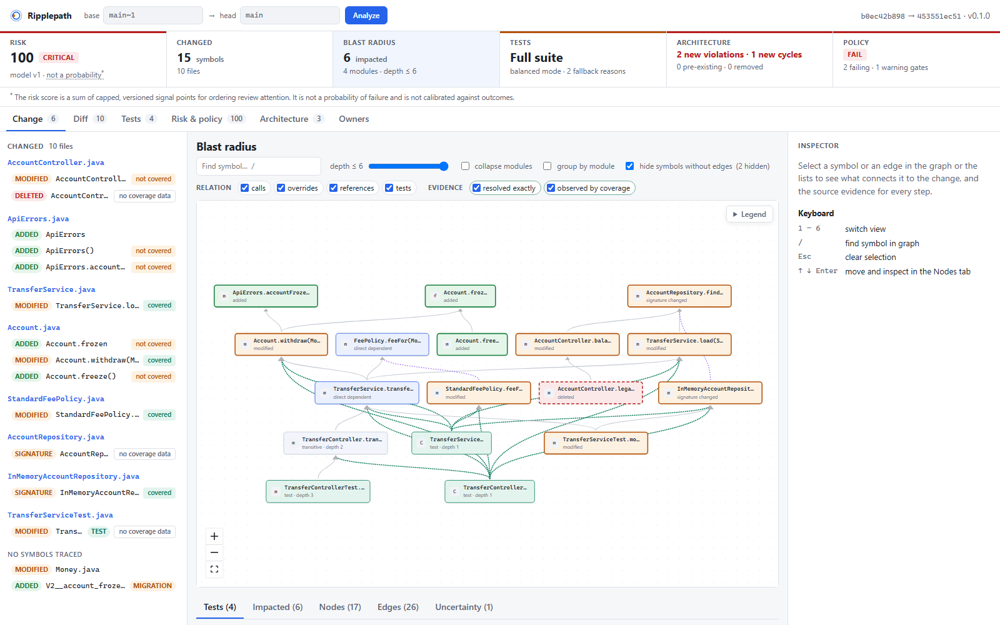
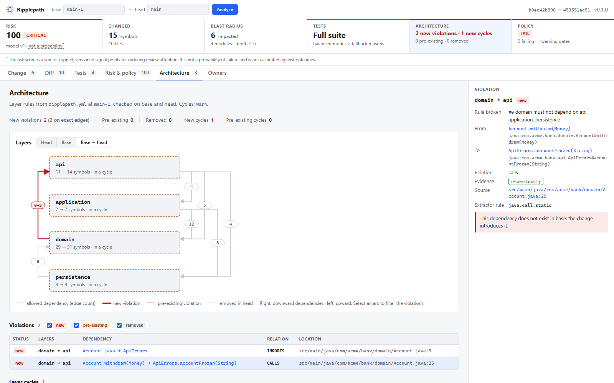
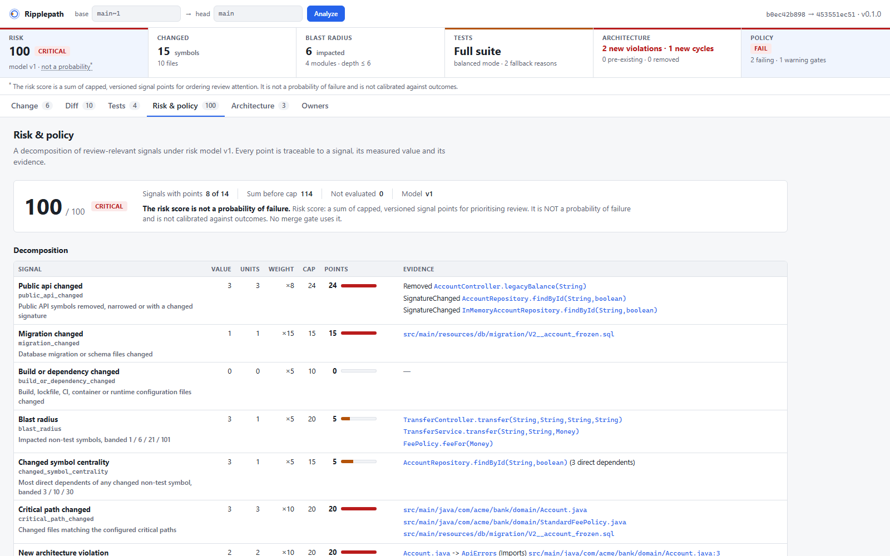

# Ripplepath

**See what a code change can break before you merge it.**



Ripplepath reads two Git revisions and finds the symbols that changed: methods, classes and
functions, not just files. It follows typed dependency edges outward from them and explains, with a
file and line for every step, which code and which tests are in the change's blast radius. It also
reports what the change does to the architecture, how the review risk breaks down into named
signals, and what it could not work out. It runs locally, needs no API keys, and never executes code
from the repository it analyses.

**Engineering highlights**

- Rust core (10 crates) with tree-sitter frontends for **Java** and **TypeScript/JavaScript**, Git
  read through `gix` object access (no `git` CLI, so no hooks, filters or `fsmonitor` from the analysed repo).
- Every edge carries evidence: kind, evidence class (`RESOLVED_EXACT`, `STATIC_INFERRED`,
  `COVERAGE_OBSERVED`, …), file, line and the resolver rule that produced it.
- Deterministic output: the same inputs give byte-identical JSON, and tests check it.
- An incremental SQLite index whose output must equal a clean re-index. A property test checks this
  over random edit histories, and a deliberately broken version of the code makes that test fail.
- Test selection that falls back to running more tests when evidence is weak, plus an offline
  replay evaluation that only uses evidence recorded before each change.
- Tried on a real Spring Boot + React project (QuantaRun). That found 2,529 unresolved references
  that fixture tests had missed, and fixing the frontends brought them down to 120.

```bash
cargo build --release
./target/release/ripplepath demo        # builds a small Java repo with one change and analyses it
```

---

## Contents

[Overview](#overview) · [Why it exists](#why-it-exists) · [60-second demo](#60-second-demo) ·
[How it works](#how-it-works) · [Semantic change graph](#semantic-change-graph) ·
[Test intelligence](#test-intelligence) · [Architecture drift](#architecture-drift) ·
[Risk model](#risk-model) · [GitHub integration](#github-integration) ·
[MCP for coding agents](#mcp-for-coding-agents) · [Performance](#performance) ·
[Security model](#security-model) · [Quick start](#quick-start) ·
[Supported languages](#supported-languages) · [Technology](#technology) ·
[Design decisions](#design-decisions) · [Known limitations](#known-limitations) ·
[Roadmap](#roadmap) · [Author](#author)

## Overview

Ripplepath takes a repository and two revisions (`base`, `head`) and produces one report
(`analysis.json`, schema version 1). The same report is rendered as terminal text, Markdown, SARIF,
GitHub annotations, a local web UI, and MCP tool results for coding agents. Each output is a pure
rendering of that report. The report contains:

| Section | What it answers |
|---|---|
| Changed symbols | Which methods, classes or functions were added, deleted, modified, re-signed or probably moved |
| Blast radius | Which symbols depend on them, how deep, and one explaining path per impacted symbol |
| Tests | Which tests have evidence of reaching the change, ranked, with a decision: selected subset or full suite, and why |
| Architecture | Layer-rule violations and layer cycles the change introduces (base vs head), coupling deltas |
| API surface | Public API removed, narrowed or re-signed |
| Risk | A capped, versioned sum of named signals, each with its evidence. Not a probability |
| Policy | Merge gates over concrete findings (`PASS` / `WARN` / `FAIL`) |
| Owners | CODEOWNERS of changed and impacted files |
| Uncertainty | Unresolved references, syntax errors, unsupported or oversized files, truncated traversals |

Status: works end to end for Java and TypeScript/JavaScript. No binary release has been published
yet; build from source.

## Why it exists

"What does this change break, and which tests should I run?" usually gets one of three answers:
run everything; run the tests of the files you touched; or trust a hosted, opaque model. Graph
tools know code *structure* but usually map files to tests. Test-impact products know *coverage*
but do not explain the structural path. Architecture checkers validate the current *state*, not
the *change*.

Ripplepath combines these for each change, at symbol level, and every claim it makes is a path you
can check. When evidence is weak it says so and recommends running more tests, not fewer. The
landscape survey behind this positioning is in [docs/RESEARCH.md](docs/RESEARCH.md).

## 60-second demo

```text
$ ripplepath demo
Files changed 10  |  symbols changed 15  |  impacted 4 across 4 module(s)  |  tests 3 of 3

Test selection (Balanced mode): run the FULL SUITE
  HIGH MIGRATION_CHANGED: src/main/resources/db/migration/V2__account_frozen.sql changed; its effects are not traced through code

Recommended tests, in run order (decision support, not proof of safety)
  Strong  application.TransferServiceTest#movesMoneyAndChargesFee()
      test code changed
  Medium  api.TransferControllerTest#returnsOkOnSuccessfulTransfer()
      depth 3, weakest evidence ResolvedExact
      changed      application.TransferService#load(String)
      ← CALLS        application.TransferService#transfer(String,String,Money)  (…/TransferService.java:18)
      ← CALLS        api.TransferController#transfer(String,String,String,String)  (…/TransferController.java:14)
      ← CALLS        api.TransferControllerTest#returnsOkOnSuccessfulTransfer()  (…/TransferControllerTest.java:21)

Risk 99/100 (CRITICAL), model v1
  Risk score: a sum of capped, versioned signal points for prioritising review. It is NOT a probability of failure …
Architecture: 2 new, 0 pre-existing, 0 removed violation(s); 1 new, 0 pre-existing cycle(s)
  New domain -> api: … Account.java -Imports-> api.ApiErrors  (src/main/java/com/acme/bank/domain/Account.java:3, ResolvedExact)
Policy: FAIL  (config: ripplepath.yml from base main~1)
```

(Abridged.) The demo change in the java-banking fixture adds a frozen-account feature. Its domain
class now imports an api helper, which creates a new layer cycle. It also re-signs a repository
method, removes a public endpoint and adds a SQL migration. Because of the migration, Ripplepath
recommends the full suite and lists the best tests to start with. A five-minute walkthrough is in
[docs/DEMO.md](docs/DEMO.md).

## How it works

```text
 Git repo ──► git (gix, object DB only) ──► snapshot(base), snapshot(head)
                                              │  per-file facts (tree-sitter), cached by blob id
                                              ▼
                       resolve names per snapshot ──► typed graph (symbols + evidence-carrying edges)
                                              │
       path diff + renames ──► symbol change classification (fingerprints)
                                              │
              impact traversal (BFS, explaining paths) ──► test selection ──► assess:
              architecture delta, API surface, owners, risk signals, policy gates
                                              │
                                     AnalysisReport (analysis.json v1)
              ├─ CLI: text, JSON, Markdown, SARIF, annotations   ├─ HTTP API + React UI   └─ MCP (stdio)
```

1. Resolve `base` and `head` to trees, list files, and pair renames (exact blob match first, then
   ≥ 50 % line similarity).
2. Parse Java and TypeScript/JavaScript with tree-sitter into per-file facts. Each file's facts are
   cached by blob id, so an unchanged file is parsed once. Then resolve names across the snapshot:
   imports, re-exports, declared types and hierarchies.
3. Classify symbols as added, deleted, modified, signature-changed or probable move.
4. Traverse dependents breadth-first with bounded depth. Keep the shortest, strongest-evidence path
   for each impacted symbol.
5. Select tests, evaluate architecture rules on both graphs, measure risk signals, evaluate gates.

Crate map, data flow, determinism and bounds: [docs/ARCHITECTURE.md](docs/ARCHITECTURE.md).
Contract: [docs/SPEC.md](docs/SPEC.md).

## Semantic change graph

- **Symbol identity without line numbers.** For example
  `java:com.acme.bank.domain.Money#minus(Money)` or `ts:src/cart.ts#Cart.total`. Moving a method or
  editing a neighbour does not change its identity.
- **Fingerprints, not line overlap.** Each symbol is fingerprinted with BLAKE3 over its tree-sitter
  leaf tokens, leaving out comments and nested members. Comment-only or formatting-only edits are not
  changes, and editing a method does not mark its class as changed. A deleted and an added method
  with the same name in the same owner is a *signature change*. Identical bodies under a new name
  are a *probable move*.
- **Typed edges**: `CALLS`, `INSTANTIATES`, `REFERENCES`, `EXTENDS`, `IMPLEMENTS`, `OVERRIDES`,
  `IMPORTS`, `CONTAINS`, and `TESTS` (from measured coverage). An edge is `RESOLVED_EXACT` only when
  every step that found its target follows the language's own rules over declarations in the
  repository. Anything else (several overloads of one arity, ambiguous `export *`, JDK container
  element types from a fixed table) is `STATIC_INFERRED`.
- **Dynamic dispatch.** Callers bind to the interface method, not the implementation. So when an
  implementation changes, traversal also follows `OVERRIDES` *forward* to the declaration, then
  backwards to its callers. Paths label that hop as dispatch.
- **Deleted symbols** are traversed on the base graph, because that is where their dependents still
  exist.
- **`IMPORTS` does not propagate impact.** Actually using an import already produces `CALLS` or
  `REFERENCES`. Imports still count as architecture dependencies.

## Test intelligence

Ripplepath never runs tests. It reads evidence that your CI already produced:

- **Static paths** from the graph, as above.
- **Coverage**: JaCoCo XML and LCOV, aggregate or testwise. Testwise coverage adds `TESTS` edges
  with `COVERAGE_OBSERVED` evidence and a coverage status (`COVERED` / `NOT_COVERED` / `NO_DATA`)
  for changed code.
- **CI results**: JUnit XML. From these it derives durations and flakiness. A test is `FLAKY` when
  it both passed and failed *at the same commit*. A test that fails often but consistently at each
  commit is reacting to the code, which is a different thing.

Each recommended test gets a tier (`STRONG` / `MEDIUM` / `WEAK`) from the evidence on its path. The
selection mode (`conservative`, `balanced`, `fast_feedback`) decides whether the ranked list may
replace the full suite, given fallback reasons such as `MIGRATION_CHANGED`, `BUILD_FILE_CHANGED`,
`CHANGED_FILE_NOT_UNDERSTOOD`, `UNRESOLVED_REFERENCE`, `STALE_COVERAGE` or `RESOURCE_CHANGED`.

**Offline evaluation.** `ripplepath evaluate` replays past changes. For each change it uses only
coverage and CI results recorded at the base commit or its ancestors, then scores the selection
against the tests that actually failed at head. A leakage test shows that adding head-time and later
evidence to the database leaves the report byte-identical, and that removing the restriction changes
it. On the bundled `fixtures/eval-history` (an authored 12-snapshot Java history whose tests were
really run at every snapshot):

| Mode | Failing tests caught | Full-suite fallbacks | Mean share of tests not run |
|---|---|---|---|
| conservative | 15/15 | 2/11 | 0.46 |
| balanced | 10/15 | 0/11 | 0.64 |
| fast_feedback | 10/15 | 0/11 | 0.64 |

**Small sample, not statistically meaningful:** 11 cases, 5 with failures, 15 failing tests. All
five misses come from one change to a `.properties` file that the code reads at run time. That miss
led to the `RESOURCE_CHANGED` fallback. Because the rule was added *after* seeing the miss, the
conservative 15/15 is not an independent measurement. Method, per-case results and limitations:
[docs/TEST_INTELLIGENCE.md](docs/TEST_INTELLIGENCE.md).

## Architecture drift

`ripplepath.yml` declares layers by path glob, `deny` / `allow` rules, cycle policy, critical paths
and merge gates ([docs/ARCHITECTURE_RULES.md](docs/ARCHITECTURE_RULES.md)). Rules are evaluated on
**both** revisions using the **base** revision's configuration, so a pull request cannot delete the
rule it breaks ([ADR 0005](docs/adr/0005-config-from-base-revision.md)). Each violation is keyed by
`(from symbol, to symbol, edge kind)` and classified `NEW`, `PRE_EXISTING` or `REMOVED`. Signature
changes and probable moves are mapped first, so a re-signed method does not show its violations as
both removed and new. Layer cycles are found with Tarjan's algorithm. A new violation that rests
only on inferred evidence can warn but never fail the merge.



## Risk model

**The risk score is not a probability.** It is the sum of 14 named signals, each
`min(units × weight, cap)` in integer arithmetic, capped at 100 and versioned
(`risk.model_version` 1). Every point traces back to a measured value and its evidence (symbol ids
or paths). A signal whose input is missing (for example, no coverage ingested) is reported as *not
evaluated*, not silently scored as zero risk. The weights are judgement calls and have not been
calibrated against outcomes. Signals are correlated: one import can produce a new violation and also
close a cycle, and the per-signal caps limit that effect. The score is never a merge gate; gates
evaluate concrete findings. Signal table and worked example: [docs/RISK_MODEL.md](docs/RISK_MODEL.md),
[ADR 0006](docs/adr/0006-deterministic-risk-model.md).



## GitHub integration

A composite action (`action.yml`) runs `analyze --fail-on-policy` and publishes:

- a step summary ([example](docs/assets/github-summary-example.md));
- line annotations;
- an artifact with `analysis.json`, `summary.md`, `ripplepath.sarif` and `annotations.txt`;
- optional SARIF upload to code scanning;
- an optional single PR comment, updated in place.

The step exits with status 2 when the policy fails.

```yaml
- uses: actions/checkout@v7
  with: { fetch-depth: 0, persist-credentials: false }
- uses: martiaaguilera/ripplepath@<commit-sha>   # no v* release yet: pin a commit SHA
  with:
    comment: true     # needs pull-requests: write
    sarif: false      # true needs security-events: write
```

Without a release tag, the action builds Ripplepath from the pinned commit with cargo. Release
archives with checksums are built by `.github/workflows/release.yml` once a `v*` tag exists. The
Markdown output escapes repository text so it cannot inject links, HTML or `@mentions`. The log
output is wrapped in `::stop-commands::` so file names cannot act as workflow commands. Locally:
`ripplepath analyze --base main --format markdown|sarif|github-annotations` or `--output-dir out/`.
Details: [docs/GITHUB_INTEGRATION.md](docs/GITHUB_INTEGRATION.md).

## MCP for coding agents

`ripplepath mcp --repo .` serves eight read-only tools over stdio using the
[Model Context Protocol](https://modelcontextprotocol.io): `analyze_change`, `impacted_symbols`,
`tests_for_change`, `architecture_status`, `find_symbols`, `symbol_info`, `dependency_path` and
`what_if`. An agent can ask, *before* editing, what depends on a method and which tests would cover
it. `what_if` runs the engine's own traversal from a hypothetical modification. Answers carry the
same evidence (edge kind, evidence class, file:line) as the report. The adapter is hand-written,
supports both the current stateless protocol revision and the older handshake revisions, and takes
only revision specs and symbol ids, never paths or commands. Claude Code:
`claude mcp add ripplepath -- ripplepath mcp --repo .`. Details: [docs/MCP.md](docs/MCP.md),
[ADR 0007](docs/adr/0007-read-only-mcp.md).

## Performance

Measured numbers, hardware and method are documented in [docs/BENCHMARKS.md](docs/BENCHMARKS.md).
They come from the harness in `crates/bench`, run with `scripts/bench.sh` (synthetic repositories of
configurable size, each timed run in a fresh process, optional real repository). Design choices
that matter for speed:

- Parsing is the only parallel stage (rayon).
- Per-file facts are cached by blob id, so a one-file change re-parses one file.
- Resolution is a pure in-memory pass over the whole snapshot.
- Traversal and storage are bounded (see the bounds table in ARCHITECTURE.md).

Headline medians from the 2026-10-09 run (Intel i7-6700HQ laptop, Windows 11, library call only):

- Synthetic 20,000 files (167,400 symbols, 421,306 edges): cold `index` 15.5 s, re-index of an
  unchanged revision 6.0 s, peak RSS 835 MiB, database 276 MiB.
- Impact query from one symbol: p50 17–18 µs and p95 0.87–0.94 ms at 1,000, 5,000 and 20,000
  files alike.
- QuantaRun (260 source files): cold `index` 646 ms, `analyze cb13484..3b9ec7d` 493 ms without a
  database and 328 ms with one.

## Security model

Ripplepath assumes that the repository it analyses may be hostile.

- **No execution.** It runs no builds, tests, scripts, Git hooks, filters or textconv drivers. Git
  is opened with `gix` in isolated mode. The `git` binary is never run on an analysed repository.
- **Bounded input.** Blob size is checked before inflating, and there are limits on file count,
  per-file parse time, recursion depth and output sizes. Security reviews found and fixed stack
  overflows from crafted nesting, exponential `export *` resolution and quadratic scans; each fix
  has a regression test that reproduced the bug first.
- **Untrusted text.** Terminal output neutralises control and bidi characters. The UI renders
  repository text only as text, under a strict CSP. Markdown and annotations are escaped.
- **Local server.** It is bound to 127.0.0.1, rejects any `Host` header that is not loopback (to
  stop DNS rebinding), and allows at most two concurrent analyses.
- **No index poisoning.** The index lives in the user cache directory, never inside the analysed
  repository.

Threat table: [docs/SECURITY_MODEL.md](docs/SECURITY_MODEL.md). Reporting: [SECURITY.md](SECURITY.md).

## Quick start

Requirements: Rust stable ≥ 1.99 (with MSVC build tools on Windows, for tree-sitter's C grammars),
Git (only to build the demo fixtures), Node 24 for the web UI. Run from the repository root:

```bash
cargo build --release

# Demo: builds ./ripplepath-demo (a Java repo with one change) and analyses it
./target/release/ripplepath demo
./target/release/ripplepath demo --fixture typescript-checkout --dir ../ripplepath-ts-demo

# Any repository: analyse a change, as JSON or Markdown
./target/release/ripplepath analyze --repo ripplepath-demo --base main~1 --head main --format json -o analysis.json
./target/release/ripplepath analyze --repo ripplepath-demo --base main~1 --head main --format markdown

# Persistent incremental index (default location: the user cache directory)
./target/release/ripplepath index --repo ripplepath-demo --rev main

# Web UI
(cd web && npm ci && npm run build)
./target/release/ripplepath serve --repo ripplepath-demo --base main~1 --head main
# open http://127.0.0.1:7878
```

Optional evidence: `ripplepath ingest coverage FILE --format jacoco|lcov --rev R [--test T]` and
`ripplepath ingest junit FILE --rev R` ([docs/TEST_INTELLIGENCE.md](docs/TEST_INTELLIGENCE.md)).
In the UI, keys `1`–`6` switch views, `/` finds a symbol, and `Esc` clears the selection.

## Supported languages

| Language | Status | Parser |
|---|---|---|
| Java | Implemented (static subset: records, `var`, enums, JDK collections/streams/lambdas, record patterns, …) | tree-sitter-java 0.23.5 |
| TypeScript / JavaScript (`.ts .tsx .mts .cts .js .jsx .mjs .cjs`) | Implemented (static subset: ESM imports/re-exports, classes, interfaces, object-literal members, JSX, Vitest/Jest-style tests) | tree-sitter-typescript 0.23.2 |
| Other files | Classified (migration, build, lockfile, CI, container, config, resource) to drive fallbacks; not parsed | — |

There are no cross-language edges. Exactly what is resolved and what is not is listed in
[docs/LANGUAGE_SUPPORT.md](docs/LANGUAGE_SUPPORT.md).

## Technology

- **Core (Rust 2024):** tree-sitter, gix, imara-diff (histogram line diff), BLAKE3, rayon, rusqlite
  (bundled SQLite), quick-xml, globset, serde-saphyr, clap; axum + tokio for the local server.
- **Web:** React 19, TypeScript 6 (strict), Vite 8, React Flow (`@xyflow/react`) + ELK layout,
  Vitest, Testing Library and Playwright.
- **Quality gates (CI):** `cargo fmt`, `clippy -D warnings`, `cargo test` (unit, integration,
  proptest), web typecheck, lint, unit tests and build, a Playwright end-to-end smoke against the
  real server, `cargo-deny` and `npm audit`.

## Design decisions

| ADR | Decision |
|---|---|
| [0001](docs/adr/0001-rust-core.md) | Rust for the analysis core |
| [0002](docs/adr/0002-tree-sitter-static-frontends.md) | Tree-sitter frontends with our own resolver, not compilers or LSP (those need the repository's build, i.e. executing it) |
| [0003](docs/adr/0003-read-git-without-git-cli.md) | Read Git through gix, never the git CLI |
| [0004](docs/adr/0004-sqlite-fact-cache-and-diffed-graph.md) | SQLite fact cache + graph updated by difference; incremental == clean is mandatory |
| [0005](docs/adr/0005-config-from-base-revision.md) | Configuration is read from the base revision |
| [0006](docs/adr/0006-deterministic-risk-model.md) | Deterministic, versioned risk decomposition, not a probability |
| [0007](docs/adr/0007-read-only-mcp.md) | Hand-written, read-only, dual-era MCP adapter |

The bugs and surprises behind these choices are recorded in
[docs/ENGINEERING_LOG.md](docs/ENGINEERING_LOG.md).

## Known limitations

- **Static resolution is not a compiler.** Overloads are matched by name and arity; ties become
  several `STATIC_INFERRED` edges. Generics outside a fixed JDK container table are erased, and
  type parameters of in-repo generic types are not substituted. TypeScript has no type inference:
  untyped values, unions and conditional types are not followed.
- **Runtime wiring is invisible.** Reflection, dependency injection, proxies, annotation-processor
  output and framework callbacks create dependencies that static analysis cannot see.
- **Spring HTTP routes have no edges.** A test that calls `/api/v1/jobs` through MockMvc is not
  linked to the `@GetMapping` that serves it. On QuantaRun, a changed controller signature impacted
  nothing.
- **Lambdas of non-container APIs are untyped** (AssertJ `satisfies`, JDBC row mappers, Spring
  callbacks). They are the largest remaining group of unresolved references and are reported, not
  guessed.
- **TypeScript `paths`/`baseUrl` aliases, CommonJS and dynamic `import()`** are not resolved; such
  imports are treated as external.
- **Over-selection through interfaces.** After the forward dispatch hop to an interface method,
  traversal also reaches *sibling* implementations and recommends their tests. On QuantaRun's
  reference range, 17 of 60 static-path tests were such false positives.
- **Test selection is decision support.** A static path shows that a test *can* reach the change,
  not that it checks the behaviour. Coverage shows that a line ran, not that it was asserted.
  Passing selected tests does not make a change safe.
- **Coverage freshness.** Coverage from another commit is used and flagged `STALE_COVERAGE`. Only
  the most recently *ingested* report per test counts, so history must be ingested oldest first.
- **Non-code files only widen.** A changed `.properties` file, template, migration or build file
  has no edges to the code that uses it. It raises a fallback reason and never yields specific
  tests. `RESOURCE_CHANGED` is medium severity, so balanced mode reports it but does not run the full
  suite because of it (conservative mode does).
- **The evaluation is small and authored.** 15 failing tests over 11 cases of a fixture history.
  A held-out real history is needed before any selection claim can generalise.
- **Local-first storage.** One SQLite file per repository in the user cache directory. There is no
  shared or server-side index, and resolution is recomputed over the whole snapshot on every run
  (only parsing is incremental).
- **Large graphs are summarised.** Impact stops at 5,000 symbols (`IMPACT_TRUNCATED`, a
  high-severity fallback reason), the UI graph slice at 400 nodes, and listed findings are capped with explicit
  truncation counts.
- **Committed revisions only.** The CLI, server and MCP read Git objects, never the working tree,
  so uncommitted edits are invisible.
- **Risk weights are uncalibrated.** They are documented judgement and are not fitted to outcomes.

## Roadmap

Not implemented yet:

- First tagged binary release (the release workflow exists; no `v*` tag has been pushed).
- Impact semantics that stop at callers of an interface method instead of reaching sibling
  implementations.
- A route index linking Spring `@*Mapping` paths to URL strings in tests (it would be
  `NAMING_HEURISTIC` evidence at best).
- TypeScript `paths` aliases and CommonJS; typed lambda parameters for common non-container APIs.
- Path exclusion in `ripplepath.yml` (template or vendored code is currently indexed).
- Incremental resolution, if profiling shows that whole-snapshot resolution dominates.
- An evaluation on a real, held-out project history.

## Author

Martí Aguilera — [GitHub](https://github.com/martiaaguilera) ·
[LinkedIn](https://www.linkedin.com/in/martiaaguilera/). Also by the author:
[QuantaRun](https://github.com/martiaaguilera/quantarun), a control plane for distributed AI
workloads (Java/Spring), which Ripplepath was [dogfooded on](docs/DOGFOODING_QUANTARUN.md).

Contributing: [CONTRIBUTING.md](CONTRIBUTING.md). Licensed under the [MIT License](LICENSE).
